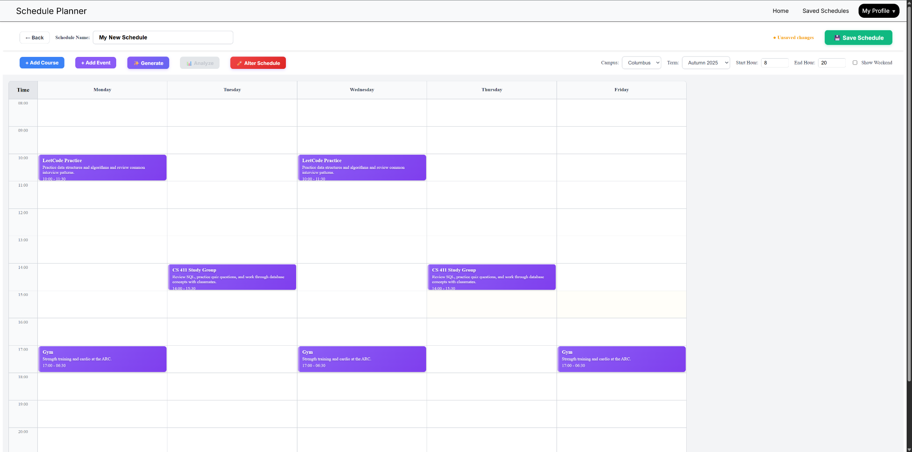
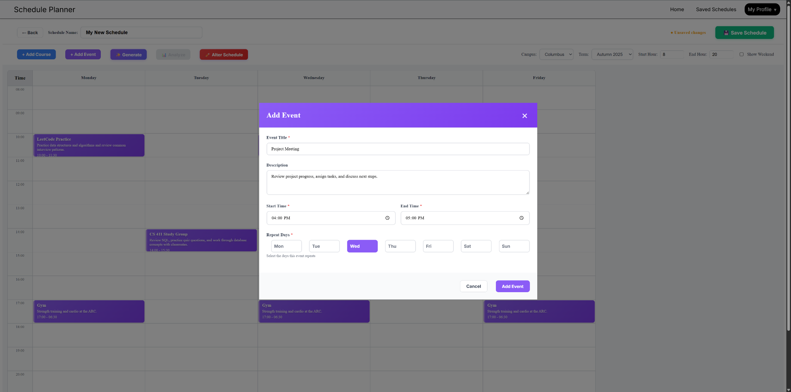
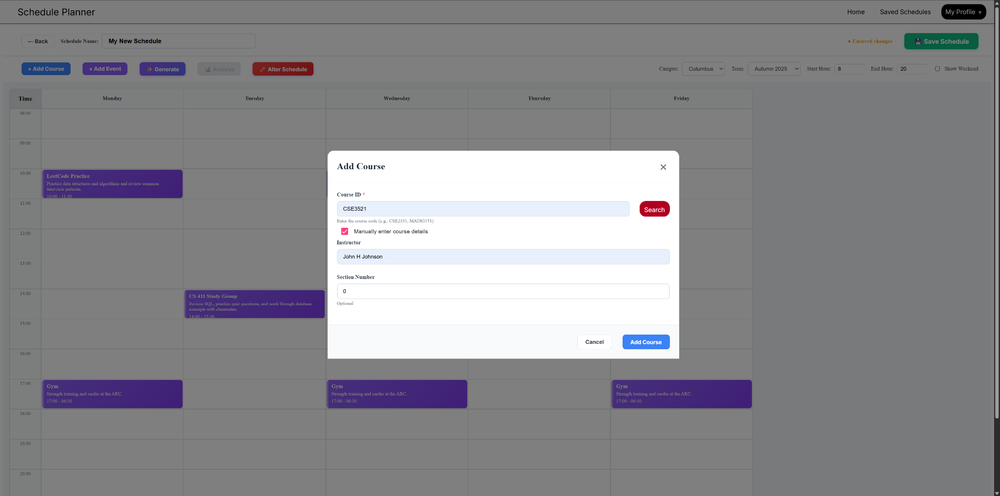

# Schedule Planner

Schedule Planner is a team-built capstone product developed for CSE 5914 at The Ohio State University. It brings course planning, recurring personal commitments, schedule comparison, and workload analysis into one application.

This repository contains the Angular and TypeScript frontend, including Firebase Authentication, Google Sign-In, application state, weekly calendar interfaces, and integration with the project's REST API. The backend implementation is not included in this repository.

## Project Overview

Schedule Planner supports the full frontend journey from authentication to a saved weekly plan. Students can search for course sections, combine them with personal events, generate candidate schedules, evaluate estimated difficulty and workload, and request replacement options when a course does not fit their needs.

The product was developed as an integrated team capstone rather than a standalone classroom UI exercise. Its frontend coordinates authentication, user profiles, persistent schedule data, course information, analysis responses, and deployment configuration.

## Key Features

- Sign in with Google through Firebase Authentication and synchronize the user with the backend
- Create, rename, save, edit, delete, and favorite multiple schedules
- Search for course sections by course number, campus, and academic term
- Choose a specific section or use manual course entry
- Add recurring personal events with descriptions, times, and selected weekdays
- Display courses and events in an interactive weekly calendar
- Configure the visible time range and optionally include weekends
- Generate and compare multiple candidate schedules
- Review schedule difficulty, estimated weekly workload, and credit hours
- Inspect detailed course ratings and workload dimensions
- Request course replacement recommendations and compare proposed schedules
- Show the next five upcoming items from the user's favorite schedule
- Build with Angular SSR support or deploy the browser bundle with Docker and Nginx

## Schedule Analysis and Recommendations

The frontend implements four backend-powered planning workflows.

### Candidate Schedule Generation

The schedule builder submits courses, recurring events, campus, and term to `POST /generate-schedule/`. Returned schedule candidates are presented as selectable options that users can compare, keep, or discard before saving.

### Schedule Analysis

The application submits schedules to `POST /generate-schedule/analyze` and renders the returned difficulty score, estimated weekly workload, total credit hours, schedule summary, and per-course ratings alongside the calendar.

### Course Ratings

The course details experience requests `GET /courses/ratings/{courseId}`, optionally including an instructor name. The UI supports:

- Overall difficulty score and estimated weekly time commitment
- Rigor, pace, assessment intensity, and project intensity
- Prerequisites and co-requisites
- Descriptive course tags
- Confidence values
- Evidence snippets returned by the backend

Course-rating responses are cached in memory to prevent duplicate requests during the same application session.

### Course Replacement Recommendations

The alteration workflow lets users select courses to replace and describe what they want from an alternative. The frontend sends the current schedule, selected courses, stored user preferences, and custom criteria to `POST /courses/class-recommendations`. Returned options are converted into previewable schedules and displayed in an original-versus-proposed calendar comparison before the user accepts a change.

These are backend-powered schedule analysis and recommendation workflows. The frontend does not run an AI model directly, and the backend implementation is not included in this repository. The frontend code does not establish whether the backend uses an AI/ML model, a rules engine, or another algorithmic approach.

## Tech Stack

### Frontend

- Angular 20
- TypeScript with strict compiler settings
- Angular standalone components
- Angular Signals and RxJS
- Angular Material
- Angular Router
- SCSS and CSS Grid
- Angular SSR with an Express server entry point

### Authentication and API Integration

- Firebase Authentication
- Google Sign-In
- Angular `HttpClient`
- REST API service layer
- Browser local storage for the current application user

### Tooling and Deployment

- Angular CLI
- ESLint and Prettier
- Jasmine and Karma
- Docker multi-stage build
- Nginx static hosting with SPA fallback routing

## Architecture

```text
                             +-------------------------+
                             | Firebase Authentication |
                             |     Google Sign-In      |
                             +------------+------------+
                                          |
                                          v
+------+       +---------------------------+---------------------------+
| User | ----> |                    Angular Frontend                    |
+------+       |  Pages / Components -> Signals / Services -> Models  |
               +---------------------------+---------------------------+
                                           |
                                           | REST API
                                           v
               +-------------------------------------------------------+
               | External Backend                                      |
               |                                                       |
               | Users and profiles   | Schedule persistence           |
               | Course search        | Schedule generation            |
               | Course ratings       | Analysis and recommendations   |
               +-------------------------------------------------------+
```

`BackendService` centralizes HTTP requests for users, schedules, course search, generation, analysis, ratings, and recommendations. `ScheduleService` manages the active schedule, saved schedules, favorite selection, and unsaved frontend state. Components consume these services through Angular dependency injection and use Signals for reactive state.

The project also includes Angular server-rendering configuration through Express. Its Docker configuration builds the application and serves the browser output through Nginx.

## Main Pages

| Page | Route | Responsibilities |
| --- | --- | --- |
| Login | `/login` | Google authentication and backend account synchronization |
| Dashboard | `/landing` | Favorite schedule, upcoming items, weekly calendar, and workload summary |
| My Schedules | `/schedules` | Saved schedule management, editing, deletion, and favorite selection |
| New Schedule | `/schedule/new` | Schedule creation, course search, events, generation, and analysis |
| Edit Schedule | `/schedule/edit/:id` | Editing and saving an existing schedule |

## Screenshots

### Weekly Schedule Builder



Recurring events, the weekly calendar, and schedule controls in the local frontend.

### Add Event Workflow



Recurring event creation with a title, description, time range, and selected repeat days.

### Manual Course Entry



Manual course entry workflow for adding course and section details directly.

## My Contribution

My primary responsibility was frontend development. I owned major frontend workflows across schedule creation, management, visualization, analysis, and recommendation experiences, integrating these interfaces with backend REST APIs.

My frontend work included the Angular UI, schedule builder, weekly calendar visualization, course and section selection, recurring event management, analysis and recommendation frontend workflows, and the client-side service layer connecting these experiences to authentication and backend data.

This was a collaborative capstone product. I do not present the backend services, AI/ML models, schedule-generation algorithm, recommendation algorithm, or team-wide outcomes as individual work.

## Team and Capstone Context

Schedule Planner was developed by a student team for CSE 5914 at The Ohio State University as a complete capstone product spanning frontend experience, backend integration, authentication, persistent data, schedule planning, and deployment.

The project was selected for a **$6,000 university funding offer to support continued development**. The team did not accept or use the funding because the members graduated and did not continue development after the capstone.

## Local Setup

### Prerequisites

- Node.js 20 or later
- npm
- A Firebase project with Google Sign-In enabled
- Access to a backend that implements the API contracts used by this frontend

### Install and Run

```bash
git clone https://github.com/EDDLK/Schedule-Planner-UI.git
cd Schedule-Planner-UI
npm install
```

Configure `src/app/environment.ts` with:

- `firebaseConfig` for the Firebase project used by the application
- `apiBaseUrl` for a compatible Schedule Planner backend

Start the application locally:

```bash
npm start
```

Open [http://localhost:4200](http://localhost:4200).

Create a production build:

```bash
npm run build
```

The compiled application is written to `dist/Schedule-Planner-UI/`.

### Docker

Build and run the Nginx image:

```bash
docker build -t schedule-planner-ui .
docker run --rm -p 8080:80 schedule-planner-ui
```

Open [http://localhost:8080](http://localhost:8080).

## Repository Scope

This repository contains the frontend application and its API integration layer. It does not contain:

- Backend source code
- Database schema or migrations
- Schedule-generation or recommendation algorithms
- AI or machine-learning model code
- Production usage, accuracy, or performance metrics

Accordingly, this README describes the workflows and integrations that can be verified from the frontend implementation without attributing unverified backend behavior or results.
